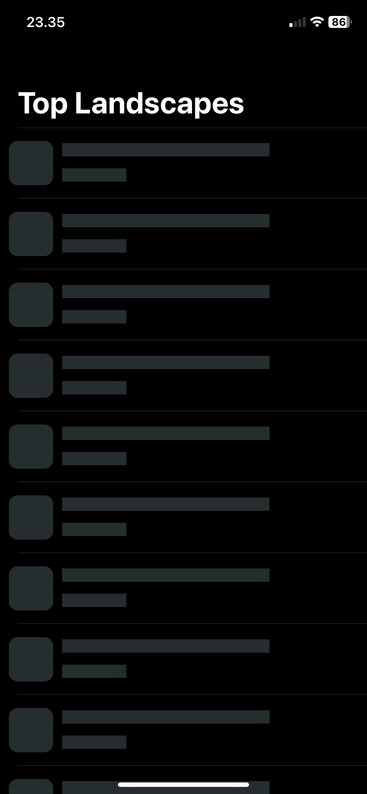
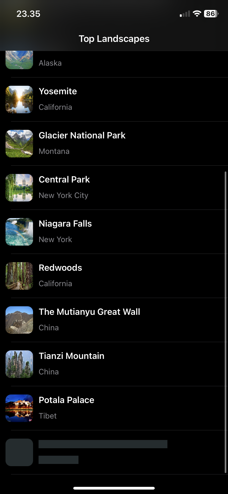
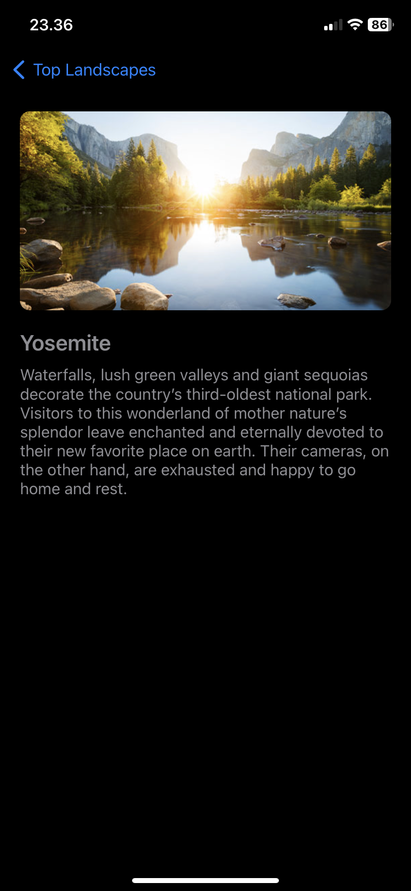

## Skeleton View & Hero Animation Swift UIKit

Today i learn how to make skeleton view in `TableView`, also i had experiment with `Hero` animation in this simple project. What i've learnt in this project : 
- Implement `SkeletonView` while loading data in `TableView`
- Load more data with `SkeletonView` loading indicator
- Hero animation from `UITableViewCell` to detail view
- Dynamic `UILabel` height

## Screenshots

|Screen 1|Screen 2|Screen 3|
|---|---|---|
||||
