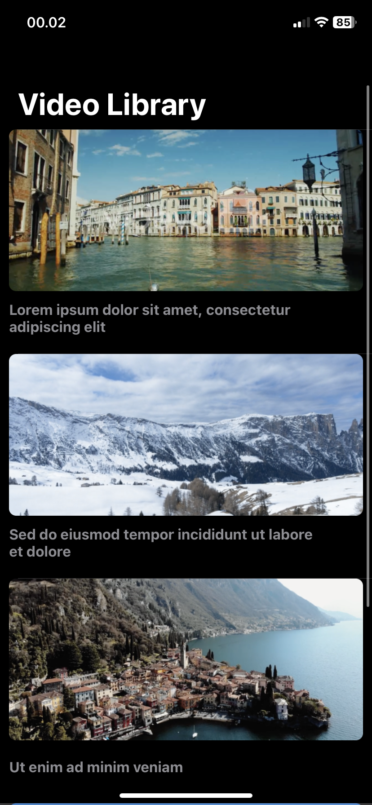
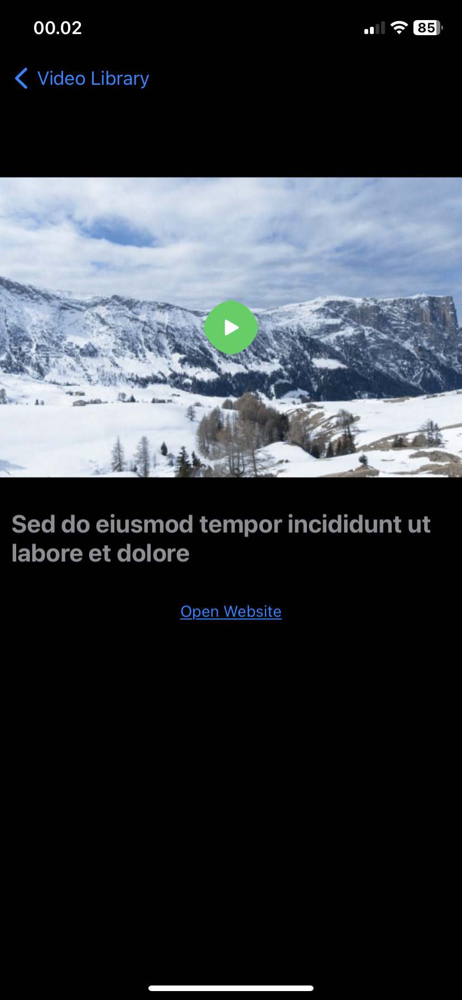
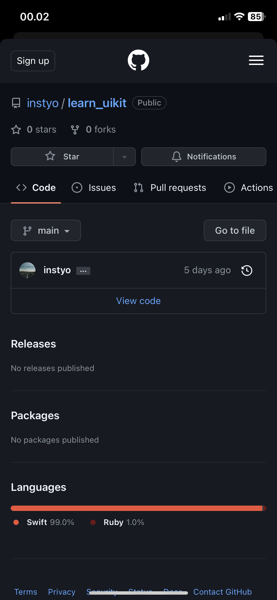

## Swift Video Player & WebView

Today i learn how to play video in swift using AVPlayer. Also i used to know how to open webview in swift with WKWebview.

- Play video from internet with `AVFoundation` & `AVPlayer`
- Open website with `WKWebview`

## Screenshots

|Screen 1|Screen 2|Screen 3|
|---|---|---|
||||
